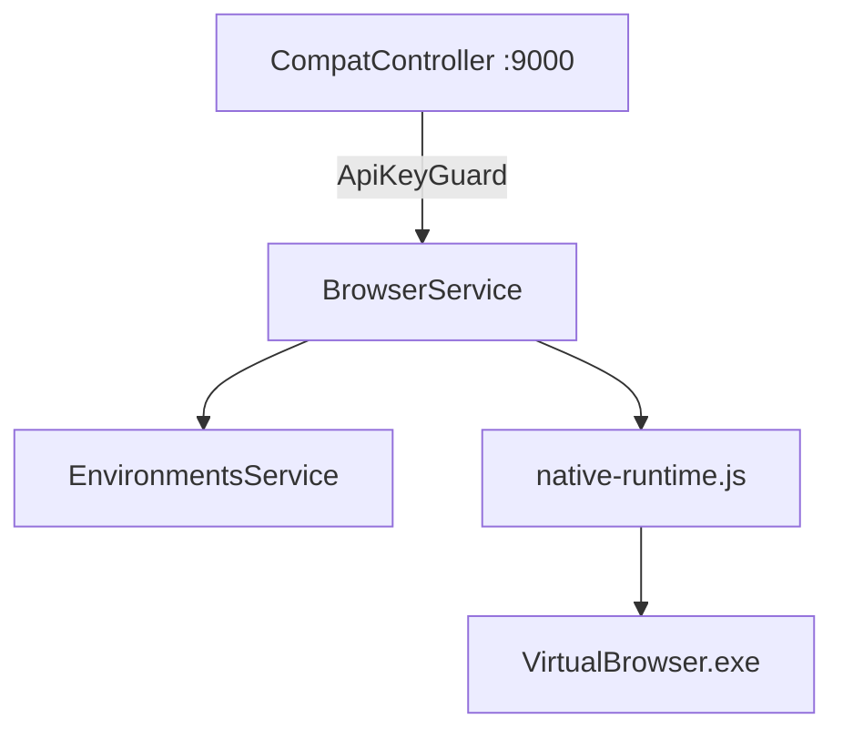

# server-backend 整合 Native REST API（逐 API 交付版）

## 交付原则（你已明确要求）

1. **一个 API 一个 API 过**：实现 → 本机 curl/脚本验收 → 写入交付文档 → 再进入下一个。
2. **做不出来就说做不出来**：不在计划里写「大概支持」，只在验收通过后标 ✅。
3. **文档不全先问你**：Apifox/官网未写清的字段，实现前列出「待确认项」；你未回复时采用**保守默认**并在交付文档标注「与官方差异」。
4. **不敷衍**：每个 API 必须有具体实现文件、映射的 native 方法、验收命令、预期 JSON。

**默认决策（你跳过范围确认题后采用）：**

- 首期交付 **8 个** Apifox/公开文档能核实的核心 API（见下表）。
- `launchBrowser` 成功响应以本仓库 `[automation/test-api.js](automation/test-api.js)` 为准：`{ success: true, data: { debuggingPort: number } }`（Apifox 未写 response schema，无法 100% 对照官方闭源行为）。
- `getBrowserList` **同时支持 GET 与 POST**（Apifox 两种写法都存在）；POST body 的 `group` 过滤首期实现。

---

## 逐 API 清单（可行性评估）

依据：[Apifox 公开页](https://2uzg2znjfy.apifox.cn/)、本仓库 `[native-bridge.js](server/mock/native-bridge.js)`、`[EnvironmentsService](server-backend/src/environments/environments.service.ts)`、`[crx-store.js](server/lib/crx-store.js)`。

| #   | 接口                           | 方法         | 能否实现        | 底层能力                                                            | 缺口/风险                                                                                       |
| --- | ---------------------------- | ---------- | ----------- | --------------------------------------------------------------- | ------------------------------------------------------------------------------------------- |
| 01  | `/api/getBrowserList`        | GET + POST | **能**       | `EnvironmentsService.listForUser` + sync 磁盘                     | POST `group` 过滤需对齐字段；响应 `data.users` 形状需对照 Apifox                                           |
| 02  | `/api/addBrowser`            | POST       | **能（核心字段）** | `EnvironmentsService.create` + sync                             | Apifox 示例含 `chrome_version/proxy/homepage`；30+ 指纹字段首期只透传已支持字段，其余存 `payload`                 |
| 03  | `/api/updateBrowser`         | POST       | **能（核心字段）** | `EnvironmentsService.update` + sync                             | 同 add；`id` 必填                                                                               |
| 04  | `/api/deleteBrowser`         | POST       | **能**       | `closeBrowser` + `deleteBrowser` + `EnvironmentsService.remove` | 运行中须先 close                                                                                 |
| 05  | `/api/launchBrowser`         | POST       | **能（核心）**   | `native-runtime.launchBrowser`                                  | **需新增** `--remote-debugging-port` 与 `debuggingPort` 返回；`tempLaunchArgs` 可拼入 spawn args（需实测） |
| 06  | `/api/closeBrowser`          | POST       | **能**       | **需新增** `closeBrowser`                                          | 当前 bridge 无此 case                                                                           |
| 07  | `/api/getBrowserRunningList` | GET        | **能**       | 已有 `getRuningBrowser`                                           | 路径名与 native 拼写 `Runing` 不一致，Compat 层做别名                                                     |
| 08  | `/api/getCrxList`            | GET        | **能**       | `crx-store.getCrxList`                                          | 返回字段可能与官方略有差异，交付文档列明                                                                        |

---

## Apifox 全量接口对照（26 项，来源 [llms.txt](https://2uzg2znjfy.apifox.cn/llms.txt)）

### 第一期：核心 8 个（原计划，必交付）

| 路径                           | 方法         | 结论                                                |
| ---------------------------- | ---------- | ------------------------------------------------- |
| `/api/getBrowserList`        | GET + POST | ✅ 能做                                              |
| `/api/addBrowser`            | POST       | ✅ 能做                                              |
| `/api/updateBrowser`         | POST       | ✅ 能做                                              |
| `/api/deleteBrowser`         | POST       | ✅ 能做                                              |
| `/api/launchBrowser`         | POST       | ✅ 能做（需新增 debuggingPort）                           |
| `/api/stopBrowser`           | POST       | ✅ 能做（**Apifox 官方名是 stopBrowser，不是 closeBrowser**） |
| `/api/getBrowserRunningList` | GET        | ✅ 能做                                              |
| `/api/getCrxList`            | GET        | ✅ 能做                                              |

### 第二期：还可交付 11 个（有底层能力或逻辑可移植）

| 路径                              | 方法   | 结论    | 说明                                                                |
| ------------------------------- | ---- | ----- | ----------------------------------------------------------------- |
| `/api/getBrowserFullParameters` | GET  | ✅ 能做  | 返回 DB `payload` 全字段 + `isRunning`；与 Apifox 示例字段对齐                 |
| `/api/isBrowserRunning`         | GET  | ✅ 能做  | query `id` → 布尔值（Apifox 响应为 bare boolean）                         |
| `/api/deleteBrowserData`        | POST | ✅ 能做  | 删 `Workers/{id}/` 用户数据，保留环境元数据                                    |
| `/api/clearCache`               | POST | ✅ 能做  | 删 Profile 内 Cache/Code Cache 等目录                                  |
| `/api/getGroupList`             | GET  | ✅ 能做  | 分组现存 `localStorage`/需迁到 backend 或 `global.dat`                    |
| `/api/addGroup`                 | POST | ✅ 能做  | 同上                                                                |
| `/api/updateGroup`              | POST | ✅ 能做  | 同上                                                                |
| `/api/deleteGroup`              | POST | ✅ 能做  | 同上                                                                |
| `/api/deleteCrx`                | POST | ✅ 能做  | 映射 `crx-store.deleteLocalCrx`                                     |
| `/api/randomizeFingerprint`     | POST | ⚠️ 能做 | 移植 `[index.vue](server/src/views/browser/index.vue)` 随机指纹逻辑；需单独验收 |
| `/api/addCrx`                   | POST | ⚠️ 部分 | **仅**接受本地上传 `{ name, base64 }` 或文件路径时可做；**仅 `storeUrl` 不能做**（见下）  |

### 第三期：可做但工作量大（需读 Chrome Profile SQLite）

| 路径                  | 方法   | 结论     | 说明                                                                        |
| ------------------- | ---- | ------ | ------------------------------------------------------------------------- |
| `/api/getCookie`    | GET  | ⚠️ 需专项 | 环境**必须已关闭**；读 `Workers/{id}/Default/Cookies`（SQLite）；需解析 Chrome cookie 格式 |
| `/api/updateCookie` | POST | ⚠️ 需专项 | 写入 Cookies DB 或同步到 `virtual.dat` 的 `cookie.jsonStr`；与官方是否写 Profile 需实测对齐  |

### 明确做不出来 / 不能诚实交付

| 路径                          | 方法   | 原因                                                                                       |
| --------------------------- | ---- | ---------------------------------------------------------------------------------------- |
| `/api/addCrx`（仅 `storeUrl`） | POST | `[crx-store](server/lib/crx-store.js)` 对商店 URL 仅 `catalogOnly` 元数据，**无法从 Chrome 商店下载安装** |
| `/api/getAccountList`       | GET  | 读 Chrome `Login Data`（加密凭据），本仓库**无实现**，Windows DPAPI 解密未做                                |
| `/api/addAccount`           | POST | 同上                                                                                       |
| `/api/deleteAccount`        | POST | 同上                                                                                       |
| `/api/updateAccount`        | POST | 同上                                                                                       |

### 响应字段已知差异（不阻塞交付，须写进 COMPAT_API.md）

| 字段                                      | Apifox 示例                 | 本仓库                                                              |
| --------------------------------------- | ------------------------- | ---------------------------------------------------------------- |
| `getBrowserRunningList[].webdriverPath` | `D:\...\chromedriver.exe` | **无 chromedriver**，可返回 `null` 或省略                                |
| `getBrowserRunningList[].debuggingPort` | 有                         | 自研 launch 后可有                                                    |
| `launchBrowser` 响应                      | schema 为空                 | 以 `[test-api.js](automation/test-api.js)` `{ debuggingPort }` 为准 |
| `isBrowserRunning`                      | 响应为 bare `boolean`        | 须严格返回 `true/false`，非 `{ success }` 包装                            |

**Apifox 合计：26 个文档条目**（含 getBrowserList 的 GET/POST 重复）。**诚实可交付：约 19 个**（8+11）；**Cookie 2 个待第三期**；**平台账号 4 个做不了**；**addCrx 商店安装做不了**。

---

| 接口/能力                                                            | 原因                                                                            |
| ---------------------------------------------------------------- | ----------------------------------------------------------------------------- |
| 官网 MCP / CLI                                                     | 闭源，本仓库无实现，**不做**                                                              |
| `checkProxy` 的 REST 暴露                                           | native-bridge 内标注 `not implemented`，**本期不做**（做了也是假实现）                         |
| Chrome 商店在线安装 CRX                                                | `crx-store` 对 url 仅 `catalogOnly` 元数据，**不能**真正从商店下载安装                         |
| `launchBrowser` 的 `headless` / `clear_cache_after_closing` 等高级参数 | Apifox 其他产品页有类似字段，VirtualBrowser 公开 Apifox **未给出**完整 schema；**本期不承诺**，除非你提供抓包 |
| 按 `remark` 单独启动环境                                                | Apifox 有示例但无 remark 字段定义；**待你确认**映射到 `name` 还是忽略                              |
| 与官方响应 **字节级一致**                                                  | 无官方闭源服务对照，**只能保证本仓库 automation 脚本跑通 + Apifox 路径/必填字段一致**                      |
| Mac/Linux 上 launch                                               | Mission 范围外 Windows 优先，**不验收**                                                |

### 待你后续确认（不阻塞首期 8 个 API）

- 是否有 **完整 Apifox 导出 JSON**（可补全遗漏接口）。
- `getBrowserList` 成功响应完整 JSON 样例（Apifox response schema 为空）。
- `launchBrowser` 官方是否还有 `wsUrl` / `browserId` 等额外字段。

---

## 实施顺序（严格串行验收）

```mermaid
flowchart LR
  Infra1[native-runtime]
  Infra2[api-key]
  A01[API-01 getBrowserList]
  A02[API-02 addBrowser]
  A03[API-03 updateBrowser]
  A04[API-04 deleteBrowser]
  A05[API-05 launchBrowser]
  A06[API-06 closeBrowser]
  A07[API-07 getBrowserRunningList]
  A08[API-08 getCrxList]
  Doc[COMPAT_API.md]

  Infra1 --> Infra2
  Infra2 --> A01 --> A02 --> A03 --> A04 --> A05 --> A06 --> A07 --> A08 --> Doc
```

**前置基础设施（两个 API 以下不算交付）：**

### 前置 A：`server/lib/native-runtime.js`

从 `[server/mock/native-bridge.js](server/mock/native-bridge.js)` 抽出 `handleNativeCall`，并新增：

- `allocateDebugPort()` / `releaseDebugPort()`
- `launchBrowser` 返回 `{ ok, debuggingPort, envId }`
- `closeBrowser(envId)`：kill + exit 钩子（pack/upload）

验收：`node server/lib/__tests__/native-runtime-smoke.js`（实现时新增）或 curl dev-bridge 调 `launchBrowser` 返回 port。

### 前置 B：自建 `api-key`

- 表 `api_keys` + `ApiKeyGuard`
- 种子 key 写入 `server-backend/data/local/initial-api-key.txt`
- `POST/GET/DELETE /api/api-keys`（admin）

验收：无 key → 401；错误 key → 401；正确 key → 200。

---

## 每个 API 的交付规格

统一约定：

- **服务地址**：`http://127.0.0.1:9000`（`COMPAT_API_PORT`，Compat 专用 listener）
- **鉴权**：Header `api-key: <自建key>`
- **错误**：`{ success: false, message: "..." }` 或 HTTP 4xx（与 `[errors.html](https://virtualbrowser.cc/zh/api/errors.html)` 无法对照时，在 `COMPAT_API.md` 自建错误码表）
- **交付物**：`docs/COMPAT_API.md` 每节含：请求示例、响应示例、实现文件、验收命令、状态 ✅/❌

---

### API-01 `getBrowserList`

| 项   | 内容                                                                                                                            |
| --- | ----------------------------------------------------------------------------------------------------------------------------- |
| 路径  | `GET /api/getBrowserList`、`POST /api/getBrowserList`                                                                          |
| 实现  | `[compat.controller.ts](server-backend/src/browser/compat.controller.ts)` → `BrowserService.getBrowserList(user, { group? })` |
| 逻辑  | `listForUser` → 可选 `group` 过滤 → `{ success: true, data: { users: [...] } }`                                                   |
| 验收  | `curl -H "api-key: ..." http://127.0.0.1:9000/api/getBrowserList`；operator 只见自己的 env                                          |

---

### API-02 `addBrowser`

| 项    | 内容                                                                              |
| ---- | ------------------------------------------------------------------------------- |
| 路径   | `POST /api/addBrowser`                                                          |
| Body | Apifox：`name`, `group[]`, `chrome_version`, `proxy`, `homepage`                 |
| 实现   | 映射为 `BrowserEnvironmentItem` → `EnvironmentsService.create` → `native-sync` 写磁盘 |
| 响应   | `{ success: true, data: { id: number } }`（对齐 Apifox 示例）                         |
| 验收   | 创建后 `getBrowserList` 可见；`Workers/{id}/virtual.dat` 存在                           |
| 限制   | 未在 Apifox 出现的指纹字段（canvas/webgl 等）首期**不单独文档化**，若 body 传入则进 `payload` 原样存储        |

---

### API-03 `updateBrowser`

| 项    | 内容                                           |
| ---- | -------------------------------------------- |
| 路径   | `POST /api/updateBrowser`                    |
| Body | `{ id, name?, proxy?, ... }`（`id` 必填，Apifox） |
| 实现   | `assertCanAccess` → `update` → sync          |
| 响应   | `{ success: true }`                          |
| 验收   | 改 proxy 后 launch 生效（抽查）                      |

---

### API-04 `deleteBrowser`

| 项    | 内容                                                                           |
| ---- | ---------------------------------------------------------------------------- |
| 路径   | `POST /api/deleteBrowser`                                                    |
| Body | `{ id: integer }`                                                            |
| 实现   | 若运行中先 `closeBrowser` → `native deleteBrowser` → `EnvironmentsService.remove` |
| 响应   | `{ success: true }`                                                          |
| 验收   | 删除后 list 无此项；重复删除返回明确错误                                                      |

---

### API-05 `launchBrowser`（最关键）

| 项    | 内容                                                                          |
| ---- | --------------------------------------------------------------------------- |
| 路径   | `POST /api/launchBrowser`                                                   |
| Body | `{ id }` 为主；支持 `name` 查 id；`tempLaunchArgs` 追加 spawn 参数                     |
| 实现   | sync 磁盘 → `native-runtime.launchBrowser` → 返回 debuggingPort                 |
| 响应   | `{ success: true, data: { debuggingPort: 192xx } }`（对齐 test-api.js）         |
| 验收   | 跑通 `[automation/test-api.js](automation/test-api.js)`：`connectOverCDP` 打开百度 |
| 风险   | CDP 端口若被占用需重试；**验收失败则本 API 标 ❌，不进入下一项**                                     |

---

### API-06 `closeBrowser`

| 项    | 内容                                       |
| ---- | ---------------------------------------- |
| 路径   | `POST /api/closeBrowser`                 |
| Body | `{ id }`                                 |
| 实现   | `native-runtime.closeBrowser`            |
| 响应   | `{ success: true }`                      |
| 验收   | 关闭后 `getBrowserRunningList` 不含该 id；进程不存在 |

---

### API-07 `getBrowserRunningList`

| 项   | 内容                                                                               |
| --- | -------------------------------------------------------------------------------- |
| 路径  | `GET /api/getBrowserRunningList`                                                 |
| 实现  | `getRuningBrowser` + 与当前用户 env 求交（不能泄露他人 running id）                             |
| 响应  | `{ success: true, data: { ids: [...] } }`（具体字段以实现时 Apifox/实测为准，写入 COMPAT_API.md） |
| 验收  | launch 后可见；close 后不可见                                                            |

---

### API-08 `getCrxList`

| 项   | 内容                                         |
| --- | ------------------------------------------ |
| 路径  | `GET /api/getCrxList`                      |
| 实现  | `crx-store.getCrxList()`                   |
| 响应  | `{ success: true, data: { list: [...] } }` |
| 验收  | 与 UI 插件列表数量一致                              |
| 限制  | 不含商店在线安装能力                                 |

---

## 架构（不变）

RBAC 路由 `/api/browser/*`（Bearer）作为**第二期**，首期全部精力在 8 个 Compat API 验收通过。

---

## 文件索引（实现时创建）

| 路径                                                             | 用途                              |
| -------------------------------------------------------------- | ------------------------------- |
| `[server/lib/native-runtime.js](server/lib/native-runtime.js)` | 共享内核调用                          |
| `server-backend/src/browser/compat.controller.ts`              | 8 个官网协议路由                       |
| `server-backend/src/browser/browser.service.ts`                | 统一业务                            |
| `server-backend/src/native/native-sync.service.ts`             | DB → 磁盘同步                       |
| `server-backend/src/api-keys/*`                                | 自建 key                          |
| `docs/COMPAT_API.md`                                           | **逐 API 交付记录（验收主文档）**           |
| `server-backend/test/compat-api/`                              | 每个 API 一个 e2e 脚本（可选，至少 curl 合集） |

---

## 生产部署（API 全部 ✅ 后）

- Nginx：`/api/*` → backend；静态 UI → `server/dist`
- `COMPAT_API_PORT=9000` 与 `PORT=3001` 同进程双 listener
- 与 `[06-deployment.md](docs/modules/06-deployment.md)` 对齐更新

---

## 开始实现的条件

你回复 **「开始实现」** 后，按顺序执行：

1. 前置 A/B
2. API-01 → … → API-08（每项验收通过才继续）
3. 汇总 `docs/COMPAT_API.md`

任一 API 验收失败：在该节写清**失败原因**与**能否修复**；不能修复的保持 ❌，不假装完成。