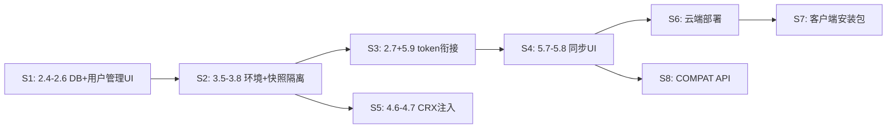

# 标准可交付基线

> **生效日期：** 2026-07-04  
> **决策：** 全项目功能均按**标准可交付**验收，不再以「MVP / 演示 / 临时环境变量」作为终态。

面向**私有化交付给客户或内部团队**：可登录、可管用户、可按角色与租户隔离环境与云数据、可跨机同步、可生产部署。

---

## 与「当前代码」的差距

| 维度 | 当前（演示级） | 标准可交付（目标） |
|------|----------------|-------------------|
| 用户 | 内存 3 账号、明文密码 | **MongoDB（生产）** / SQLite（本地 dev）+ bcrypt + **管理 UI** |
| 存储策略 | 仅 Mongo，本机需装库 | **`STORAGE_DRIVER=local` 开箱即用**（SQLite）；上线 **`mongo`** |
| 权限 | 前端藏菜单/按钮 | UI + **API 资源鉴权** + 环境归属 |
| 环境数据 | 本地 json 全员可见 | `ownerId`/`tenantId` + backend 过滤 |
| 云同步 | 手动 `CLOUD_API_TOKEN` | **登录 token 自动** + 同步状态 UI |
| 插件 | 列表 MVP，启动未注入 | 环境绑定 + **launch 加载** + 权限 |
| 部署 | dev 三板斧 | **客户端 exe（S7）+ 云端 API（S6）+ Compat :9000（S8）** |

**后端统一入口：** [`server-backend/`](../server-backend/)（Auth、用户、角色、环境元数据、Profile 快照、未来 CRX 元数据 API）。  
**存储：** 本地开发 `STORAGE_DRIVER=local`（SQLite，见 [07-backend-stack](modules/07-backend-stack.md)）；**生产交付必须 `STORAGE_DRIVER=mongo`**。  
**前端：** [`server/`](../server/)（业务 UI + 系统管理 UI）。  
**本机内核：** [`server/mock/native-bridge.js`](../server/mock/native-bridge.js)（dev）/ 生产 native 代理（见 [06-deployment](modules/06-deployment.md)）。

---

## 标准可交付：模块验收清单

### 02 + 03 账号与权限（核心）

- [x] 用户表持久化；密码哈希；禁止明文
- [x] **`/system/users` 管理页**（仅 admin）：创建/禁用/重置密码/分配角色
- [x] 固定三角色 `admin` / `operator` / `viewer`；角色变更立即反映路由与按钮
- [x] 登出清 token + `resetRouter()`；未登录不可访问业务页
- [x] 环境列表带 `ownerId`、`tenantId`；API/bridge **按当前用户过滤**
- [x] 快照 API 路径 `data/profiles/{tenantId}/{envId}/`（**legacy 路径仍可读**）；跨 env **403 归属校验**
- [x] 所有 `server-backend` 业务 API 走 AuthGuard（除 `/health`、`/auth/login`）

### 05 Profile 云同步

- [x] 登录 token 自动用于 pull/upload（dev-native-bridge Bearer；`CLOUD_API_TOKEN` 可选兜底）
- [x] 环境列表展示同步状态；「立即同步」按钮（上传/拉取/刷新）
- [ ] 跨机 A→B 验收文档/脚本

### 04 CRX 插件

- [ ] 环境表单绑定插件；`launchBrowser` 加载扩展
- [ ] viewer 不可上传/删除 CRX（UI + 后端策略）

### 00 Native Bridge

- [ ] 生产 native 代理方案落地；bridge 调用需已登录上下文
- [ ] `getBrowserList` 与 backend 环境归属一致

### 01 UI + 06 部署

- [ ] staging/prod 环境变量与文档一致
- [ ] **S6 云端：** `CLOUD_DEPLOY.md`、Mongo、HTTPS、CORS
- [ ] **S7 客户端：** Setup.exe、desktop-shell、禁止恢复 app.asar
- [ ] worker deploy、交付检查清单

### 08 COMPAT API（S8）

- [ ] INFRA-A `native-runtime.js` 单源（dev + desktop + compat 共用）
- [ ] 第一期 API-01–08 逐接口验收（见 [COMPAT_API.md](COMPAT_API.md)）
- [ ] `automation/test-api.js` 对 `:9000` launchBrowser CDP 成功
- [ ] BLOCK 项保持 blocked，不虚假标 done

---

## 推荐实施顺序（标准可交付）

| 阶段 | 任务 ID | 交付物 |
|------|-----------|--------|
| S1 | 2.4–2.6, 2.10–2.12 | DB + 用户管理 UI |
| S2 | 3.4–3.8, 3.13–3.14 | 环境/快照隔离 |
| S3 | 2.7, 5.9 | 云同步 token |
| S4 | 5.7–5.8 | 同步 UI |
| S5 | 4.6–4.7 | CRX 注入 |
| **S6** | 6.1–6.9 | 云端 Mongo + HTTPS |
| **S7** | desktop-shell, NSIS | 客户端 Setup.exe |
| **S8** | COMPAT INFRA + API-01–08 | Apifox REST :9000 |

---

## 明确不做（仍 Out of scope）

- 细粒度 Permission 表（`env:delete` 等可配置权限码）— 先用固定三角色
- 自助注册 / 找回密码 — 除非客户合同要求
- Mac/Linux 客户端、Chromium 自编译、License 计费

---

## 文档索引

| 模块 | 文档 |
|------|------|
| 登录 + 用户管理 | [02-auth-login](modules/02-auth-login.md) |
| RBAC | [03-rbac-permissions](modules/03-rbac-permissions.md) |
| COMPAT API（S8） | [COMPAT_API](COMPAT_API.md) |
| Multitask | [AGENT_COORDINATION](AGENT_COORDINATION.md) |
| 衔接 | [INTEGRATION](INTEGRATION.md) |
