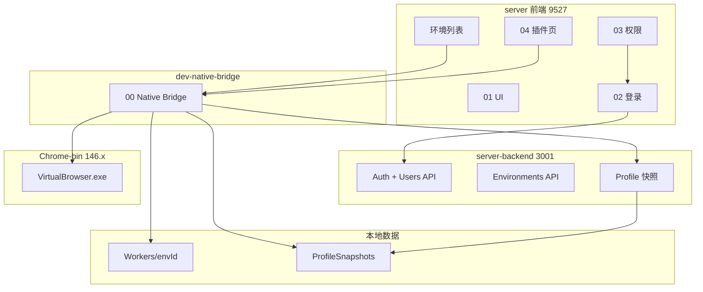
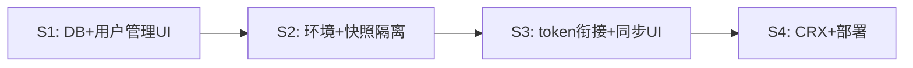

# VirtualBrowser 二开 — 开发文档索引

> **最后更新：** 2026-07-05  
> **架构：** 路线 B（浏览器 dev + dev-native-bridge + 内层 Chromium 146.x）  
> **交付基线：** [**标准可交付**](DELIVERY_STANDARD.md)（全模块按此验收，非 MVP 演示）  
> **验收记录：** [**分阶段验收**](ACCEPTANCE.md)（步骤 + 进度勾选 + 问题记录）  
> **Mission：** 见根目录 [`MISSION.md`](../MISSION.md)

本目录将开发清单**按模块拆分**。跨模块对接见 [`INTEGRATION.md`](INTEGRATION.md)；**验收标准**见 [`DELIVERY_STANDARD.md`](DELIVERY_STANDARD.md)；**验收步骤与进度**见 [**ACCEPTANCE.md**](ACCEPTANCE.md)。

---

## 模块一览

| 模块 | 文档 | 状态 | 一句话 |
|------|------|------|--------|
| 00 | [native-bridge](modules/00-native-bridge.md) | 🟢 基本完成 | 环境 CRUD、启动内核、dev-native-bridge |
| 01 | [ui-branding](modules/01-ui-branding.md) | 🟢 基本完成 | 品牌、主题、登录页私有化 |
| 02 | [auth-login](modules/02-auth-login.md) | ✅ S1 已验收 | 登录 + DB + **/system/users** + 登出 |
| 03 | [rbac-permissions](modules/03-rbac-permissions.md) | 🟡 S2 待验收 | 环境 API + 归属 + 快照 403 |
| 04 | [crx-extensions](modules/04-crx-extensions.md) | 🟡 部分完成 | 插件 native API + 管理页 MVP |
| 05 | [profile-cloud-sync](modules/05-profile-cloud-sync.md) | 🟡 部分完成 | Cookie/缓存打包上云、跨机 pull |
| 06 | [deployment](modules/06-deployment.md) | 🔴 未开始 | 生产构建、托管、交付物 |
| 07 | [backend-stack](modules/07-backend-stack.md) | 🟢 基本完成 | Nest + **本地 SQLite / 生产 Mongo** |

---

## 模块关系



---

## 推荐阅读顺序

**新接手 Agent / 开发者：**

1. [`PROJECT_PROGRESS.md`](../PROJECT_PROGRESS.md) — 一句话现状 + 常见坑 + 检查清单  
2. 本页模块表 — 确认各模块状态  
3. [`INTEGRATION.md`](INTEGRATION.md) — 跨模块衔接缺口（**改功能前先读**）  
4. 按任务进入对应 `modules/XX-*.md`

**按场景跳转：**

| 场景 | 读哪份 |
|------|--------|
| 创建/启动指纹环境 | [00-native-bridge](modules/00-native-bridge.md) |
| 换 Logo / 主题 | [01-ui-branding](modules/01-ui-branding.md) |
| 登录失败 / token | [02-auth-login](modules/02-auth-login.md) |
| 角色看不到菜单 / 按钮 | [03-rbac-permissions](modules/03-rbac-permissions.md) |
| 插件上传 / 空白页 | [04-crx-extensions](modules/04-crx-extensions.md) |
| Cookie 跨机不同步 | [05-profile-cloud-sync](modules/05-profile-cloud-sync.md) + [INTEGRATION](INTEGRATION.md) |
| 上线交付 | [06-deployment](modules/06-deployment.md) |
| 后端存储 / 本地零依赖 | [07-backend-stack](modules/07-backend-stack.md) |

---

## 推荐实施顺序（标准可交付）

详见 [`DELIVERY_STANDARD.md`](DELIVERY_STANDARD.md)。摘要：



| 阶段 | 任务 ID | 说明 |
|------|---------|------|
| **S1** | [2.4–2.6](modules/02-auth-login.md#5)、[2.10–2.12](modules/02-auth-login.md#5)、[3.10–3.11](modules/03-rbac-permissions.md#310) | DB + 用户管理 UI + 系统路由 |
| **S2** | [3.4–3.5](modules/03-rbac-permissions.md#35)、[3.8](modules/03-rbac-permissions.md#38)、[3.13–3.14](modules/03-rbac-permissions.md#35) | API 鉴权 + 环境/快照 tenant 隔离 |
| **S3** | [2.7](modules/02-auth-login.md#5)、[5.9](modules/05-profile-cloud-sync.md#59)、[5.7–5.8](modules/05-profile-cloud-sync.md#57) | 登录 token 云同步 + 同步 UI |
| **S4** | [4.6–4.7](modules/04-crx-extensions.md#46)、[6.1–6.9](modules/06-deployment.md) | CRX 注入 + 生产部署 |

---

## 日常开发命令

```powershell
# 终端 1 — 后端（默认 SQLite，无需 Mongo）
cd D:\bytesio\VirtualBrowser\server-backend
npm install
copy .env.example .env   # STORAGE_DRIVER=local
npm run start:dev

# 终端 2 — 前端 + native 桥接
cd D:\bytesio\VirtualBrowser\server
npm install
npm run dev   # → http://localhost:9527

# 云同步（dev：登录 UI 即可，无需 CLOUD_API_TOKEN；见 ACCEPTANCE S3）
# admin 登录 → 启动环境 → 关闭 → 终端 cloud upload ok
```

---

## 不在本目录的内容

| 文档 | 用途 |
|------|------|
| [`MISSION.md`](../MISSION.md) | 长期目标与边界 |
| [`NOTES.md`](../NOTES.md) | 用户偏好备忘 |
| [`config/PATHS.md`](../config/PATHS.md) | 路径与命令 |
| [`lessons/`](../lessons/) | 教学 HTML |
| [`reference/`](../reference/) | 术语速查 |

---

## 文档维护约定

- **单模块待办**只写在 `modules/XX-*.md`，不在本页重复长表  
- **跨模块对接**只写在 [`INTEGRATION.md`](INTEGRATION.md)  
- 任务 ID 格式：`{模块号}.{序号}`（如 `5.7`）  
- 完成一项后在对应模块文档 §4 打 `[x]`，并更新本页状态列
