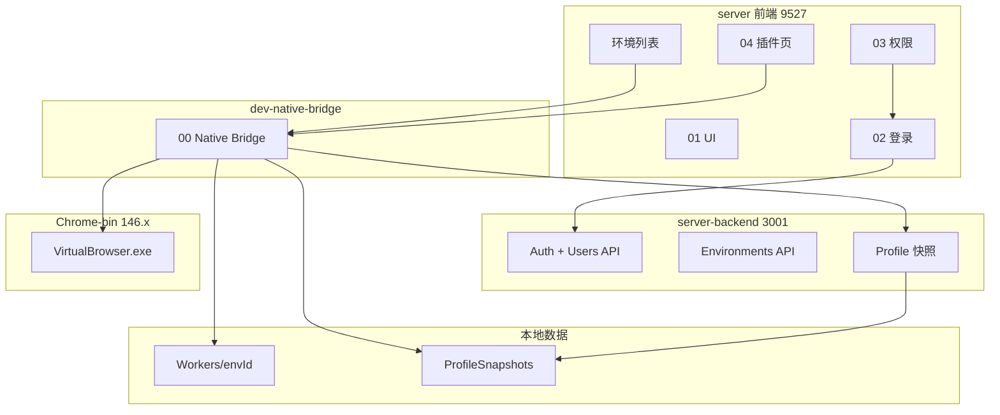
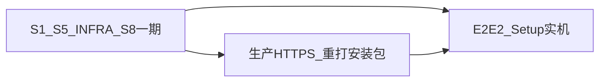

# VirtualBrowser 二开 — 开发文档索引

> **最后更新：** 2026-07-14  
> **架构：** 路线 B（dev）+ 三轨交付（S6 云端 / S7 客户端 / S8 COMPAT API）  
> **交付基线：** [**标准可交付**](DELIVERY_STANDARD.md)  
> **验收真相：** [**ACCEPTANCE.md**](ACCEPTANCE.md) 总进度一览（S1–S8）  
> **Multitask：** [**AGENT_COORDINATION.md**](AGENT_COORDINATION.md)（**开工先读**）  
> **Mission：** [`MISSION.md`](../MISSION.md)

本目录将开发清单**按模块拆分**。跨模块对接见 [`INTEGRATION.md`](INTEGRATION.md)；**验收标准**见 [`DELIVERY_STANDARD.md`](DELIVERY_STANDARD.md)；**验收步骤与进度**见 [**ACCEPTANCE.md**](ACCEPTANCE.md)。

---

## 模块一览

| 模块 | 文档 | 状态 | 一句话 |
|------|------|------|--------|
| 00 | [native-bridge](modules/00-native-bridge.md) | 🟢 基本完成 | 环境 CRUD、启动内核、dev-native-bridge |
| 01 | [ui-branding](modules/01-ui-branding.md) | 🟢 基本完成 | 品牌、主题、登录页私有化 |
| 02 | [auth-login](modules/02-auth-login.md) | ✅ S1 已验收 | 登录 + DB + **/system/users** + 登出 |
| 03 | [rbac-permissions](modules/03-rbac-permissions.md) | ✅ S2 已通过 | 环境 API + 归属 + 快照 403 |
| 04 | [crx-extensions](modules/04-crx-extensions.md) | 🟡 S5 基本通过 | 绑定+注入 ✅；扩展目视待用户 |
| 05 | [profile-cloud-sync](modules/05-profile-cloud-sync.md) | ✅ S3/S4 | 自动 token + 同步 UI |
| 06 | [deployment](modules/06-deployment.md) | 🟡 S6/S7 进行中 | mongo HTTP ✅；Setup.exe ✅；HTTPS/实机待验 |
| 07 | [backend-stack](modules/07-backend-stack.md) | 🟢 基本完成 | Nest + SQLite / Mongo |
| 08 | [compat-api](modules/08-compat-api.md) → [COMPAT_API](COMPAT_API.md) | 🟢 第一期 done | API-01–08 ✅；第二期 pending |

---

## 模块关系



---

## 推荐阅读顺序

**新接手 Agent / 开发者（Multitask）：**

1. [`AGENT_COORDINATION.md`](AGENT_COORDINATION.md) — 认领任务、文件所有权  
2. [`PROJECT_PROGRESS.md`](../PROJECT_PROGRESS.md) — 三轨现状 + 常见坑  
3. [`ACCEPTANCE.md`](ACCEPTANCE.md) — **阶段验收真相** S1–S8  
4. [`INTEGRATION.md`](INTEGRATION.md) — 改跨模块功能前先读  
5. 进入对应 `modules/XX-*.md` 或 [`COMPAT_API.md`](COMPAT_API.md)（S8）

**按场景跳转：**

| 场景 | 读哪份 |
|------|--------|
| Multitask 并行 / 防冲突 | [AGENT_COORDINATION](AGENT_COORDINATION.md) |
| 阶段验收勾选 | [ACCEPTANCE](ACCEPTANCE.md) + [acceptance-reports/](acceptance-reports/) |
| 创建/启动指纹环境 | [00-native-bridge](modules/00-native-bridge.md) |
| 换 Logo / 主题 | [01-ui-branding](modules/01-ui-branding.md) |
| 登录失败 / token | [02-auth-login](modules/02-auth-login.md) |
| 角色看不到菜单 / 按钮 | [03-rbac-permissions](modules/03-rbac-permissions.md) |
| 插件上传 / launch 注入 | [04-crx-extensions](modules/04-crx-extensions.md) |
| Cookie 跨机不同步 | [05-profile-cloud-sync](modules/05-profile-cloud-sync.md) |
| **部署云端** | [06-deployment](modules/06-deployment.md) + [CLOUD_DEPLOY](CLOUD_DEPLOY.md) |
| **打客户端安装包** | [06-deployment](modules/06-deployment.md) §客户端线 |
| **自动化 / Playwright API** | [COMPAT_API](COMPAT_API.md) + [08-compat-api](modules/08-compat-api.md) |
| 后端存储 | [07-backend-stack](modules/07-backend-stack.md) |

---

## 推荐实施顺序（三轨）

详见 [`DELIVERY_STANDARD.md`](DELIVERY_STANDARD.md) 与 [`ACCEPTANCE.md`](ACCEPTANCE.md)。

| 阶段 | 状态 | 说明 |
|------|------|------|
| S1–S4 | ✅ | 登录、权限、云同步、同步 UI |
| S5 | ✅ 基本通过 | CRX；用户目视 `chrome://extensions` 待确认 |
| INFRA-A/B/C | ✅ | native-runtime + api-key + :9000 |
| **S6** | 🟢 | mongo HTTP ✅；**HTTPS 待运维** |
| **S7** | 🟡 | **Setup-0.1.0.exe 已产出**；实机/生产 API 待验 |
| **S8** | 🟡 第一期基本通过 | API-01–08 ✅；第二期未做 |



**下一拨 Multitask：** E2E-2 实机 + 生产 HTTPS（见 [`AGENT_COORDINATION.md`](AGENT_COORDINATION.md)）

---

## 日常开发命令

```powershell
# 终端 1 — 后端（默认 SQLite，无需 Mongo）
cd D:\bytesio\VirtualBrowser\server-backend
npm install
copy .env.example .env   # STORAGE_DRIVER=local
npm run start:dev

# 终端 2 — 前端 + native 桥接
cd D:\bytesio\VirtualBrowser\server
npm install
npm run dev   # → http://localhost:9527

# 云同步（dev：登录 UI 即可，无需 CLOUD_API_TOKEN；见 ACCEPTANCE S3）
# admin 登录 → 启动环境 → 关闭 → 终端 cloud upload ok
```

---

## 不在本目录的内容

| 文档 | 用途 |
|------|------|
| [`AGENT_COORDINATION.md`](AGENT_COORDINATION.md) | Multitask 认领与所有权 |
| [`acceptance-reports/`](acceptance-reports/) | 给用户验收的报告 |
| [`MISSION.md`](../MISSION.md) | 长期目标 |
| [`NOTES.md`](../NOTES.md) | 用户偏好备忘 |
| [`config/PATHS.md`](../config/PATHS.md) | 路径与命令 |
| [`lessons/`](../lessons/) | 教学 HTML |
| [`reference/`](../reference/) | 术语速查 |

---

## 文档维护约定

- **单模块待办**只写在 `modules/XX-*.md`，不在本页重复长表  
- **跨模块对接**只写在 [`INTEGRATION.md`](INTEGRATION.md)  
- 任务 ID 格式：`{模块号}.{序号}`（如 `5.7`）  
- 完成一项后在对应模块文档 §4 打 `[x]`，并更新本页状态列
