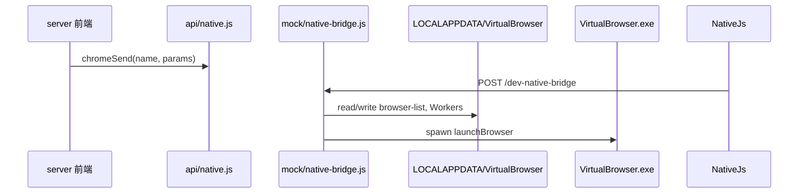

# 模块 00 — Native Bridge（环境 CRUD 与内核启动）

> **状态：** 🟢 基本完成  
> **交付基线：** [DELIVERY_STANDARD.md](../DELIVERY_STANDARD.md)  
> **最后更新：** 2026-07-04

## 1. 目标与边界

**负责：**

- 路线 B 下浏览器 dev 模式与指纹内核的通信（`dev-native-bridge`）
- 指纹环境配置的读写（`browser-list.json`、`virtual.dat`）
- 启动 / 停止内层 `VirtualBrowser.exe`
- 与 profile 打包、云同步、CRX 的 **native 入口**（具体逻辑在 lib 模块）

**不负责：**

- 用户登录与 RBAC（见 [02-auth-login](02-auth-login.md)、[03-rbac-permissions](03-rbac-permissions.md)）
- 云快照存储实现（见 [05-profile-cloud-sync](05-profile-cloud-sync.md) 后端部分）
- Chromium 内核修改

---

## 2. 架构与数据流



**本地数据路径：**

| 路径 | 内容 |
|------|------|
| `User Data/browser-list.json` | 全部环境配置列表 |
| `User Data/global.dat` | 全局 JSON 配置 |
| `Workers/{envId}/` | Chromium `--user-data-dir` |
| `Workers/{envId}/virtual.dat` | 单环境指纹 JSON |

---

## 3. 关键文件索引

| 路径 | 职责 |
|------|------|
| [`server/src/api/native.js`](../../server/src/api/native.js) | 前端统一入口；dev 走 fetch bridge |
| [`server/src/api/native-bridge-client.js`](../../server/src/api/native-bridge-client.js) | 判断是否 dev bridge 模式 |
| [`server/mock/native-bridge.js`](../../server/mock/native-bridge.js) | Node 侧 native 实现 |
| [`server/mock/mock-server.js`](../../server/mock/mock-server.js) | 注册 bridge 路由 |
| [`config/chrome-bin.paths.json`](../../config/chrome-bin.paths.json) | 内核 exe 路径 |
| [`server/lib/profile-sync.js`](../../server/lib/profile-sync.js) | profile 打包（被 bridge 调用） |
| [`server/lib/cloud-sync.js`](../../server/lib/cloud-sync.js) | 云 pull/upload（被 bridge 调用） |
| [`server/lib/crx-store.js`](../../server/lib/crx-store.js) | CRX 列表（被 bridge 调用） |

---

## 4. 已完成清单

- [x] **0.0** 路线 B 落地 — 删除外层 Electron，保留 146.x 内核 — `Chrome-bin/VirtualBrowser/146.0.7680.72/`
- [x] **0.0** dev-native-bridge — `POST /dev-native-bridge` 挂 webpack devServer
- [x] **0.0** `getBrowserList` / `setBrowserList` — 读写 `browser-list.json`，同步 `Workers/{id}/virtual.dat`
- [x] **0.0** `launchBrowser` — `spawn` + `--worker-id` + `--user-data-dir`
- [x] **0.0** `deleteBrowser` / `getRuningBrowser` / `getBrowserVersion`
- [x] **0.0** `getGlobalData` / `setGlobalData` — `User Data/global.dat`
- [x] **0.0** launch 前 cloud pull、exit 后 auto-pack + upload — 见 [05-profile-cloud-sync](05-profile-cloud-sync.md)
- [x] **0.0** CRX native 方法转发 — 见 [04-crx-extensions](04-crx-extensions.md)
- [x] **0.0** `packProfile` / `unpackProfile` / `getProfileLocalMeta` — 见 [05-profile-cloud-sync](05-profile-cloud-sync.md)

---

## 5. 待办清单（细粒度）

### 5.1 生产与代理

| ID | 任务 | 验收标准 | 优先级 | 依赖模块 |
|----|------|----------|--------|----------|
| 0.1 | 生产 native 代理方案定稿 | [06-deployment](06-deployment.md) 落地 | **P0** | [06.3](06-deployment.md) |
| 0.2 | checkProxy 实现或明确废弃 | browser 页检测代理有真实结果或 UI 标注 | P2 | — |

### 5.2 安全与审计

| ID | 任务 | 验收标准 | 优先级 | 依赖模块 |
|----|------|----------|--------|----------|
| 0.3 | bridge 调用审计日志 | envId + 方法 + userId | P2 | [03.4](03-rbac-permissions.md#34) |
| 0.4 | 生产 bridge 鉴权 | 未登录不可 launch/delete | **P0** | [INTEGRATION §Auth→Bridge](../INTEGRATION.md#auth-bridge) |

### 5.3 与环境 / 插件衔接

| ID | 任务 | 验收标准 | 优先级 | 依赖模块 |
|----|------|----------|--------|----------|
| 0.5 | launchBrowser 注入 CRX | spawn 扩展参数 | **P0** | [04.6](04-crx-extensions.md#46) |
| 0.6 | getBrowserList 按用户过滤 | 与 backend `/api/environments` 一致 | **P0** | [3.13](03-rbac-permissions.md#35) |

---

## 6. 手动验证步骤

```powershell
# 1. 确认内核存在
Test-Path D:\bytesio\VirtualBrowser\Chrome-bin\VirtualBrowser\146.0.7680.72\VirtualBrowser.exe

# 2. 启动 dev
cd D:\bytesio\VirtualBrowser\server
npm run dev

# 3. 测 bridge
curl -s -X POST http://localhost:9527/dev-native-bridge `
  -H "Content-Type: application/json" `
  -d '{"name":"getBrowserList","params":[]}'

# 4. UI：创建环境 → 启动 → 应弹出指纹窗口
```

**常见错误：**

| 现象 | 处理 |
|------|------|
| `chrome.send is not a function` | 必须用 `npm run dev`，非静态服务器 |
| 内核不存在 | 安装/恢复 `Chrome-bin/146.x` |
| 云同步弹出 `timeout` | 须使用已修复的 `chromeSendTimeout` 路径（拉取/上传 120s）；旧包会在 2s 误报 |

---

## 8. 指纹参数是否生效 — 自测

编辑保存后配置写入 `%LOCALAPPDATA%\VirtualBrowser\Workers\{id}\virtual.dat`；启动时由内核读取。云同步只同步 Cookies/Cache 等 profile，**不含**指纹 JSON。

### 人工对照（改一项 → 确定保存 → 启动）

| 要测的项 | 编辑里怎么设 | 启动后怎么看 |
|----------|--------------|--------------|
| 启动主页 | 自定义 URL | 地址栏是否为目标站 |
| UA | 自定义，末尾加标记如 `MyProbe/1` | `chrome://version` 或站点查看 UA |
| 分辨率 | 自定义宽高 | F12：`screen.width/height` |
| CPU/内存 | 非常见值如 3 核 / 2GB | `navigator.hardwareConcurrency` / `deviceMemory` |
| WebGL | 自定义厂商/渲染 | BrowserLeaks WebGL |
| Cookie | 开启导入 JSON | 目标域 `document.cookie` |
| 代理 | 自定义代理 | 对比出口 IP（如 ipify） |

注意：「按 IP 生成语言/时区」依赖默认主页进入 `chrome://virtual-worker`；自定义主页时这些可能不刷新。

### 一键脚本（开发机，需 Chrome-bin）

```powershell
cd D:\bytesio\VirtualBrowser
node server/lib/__tests__/fingerprint-runtime-probe.js
```

示例报告：[`docs/acceptance-reports/fingerprint-settings-2026-07-19.md`](../acceptance-reports/fingerprint-settings-2026-07-19.md)

---

## 9. 关联模块

- **上游：** [02-auth-login](02-auth-login.md)（未来 bridge 鉴权）、[03-rbac](03-rbac-permissions.md)（环境过滤）
- **下游：** [05-profile-cloud-sync](05-profile-cloud-sync.md)（launch 生命周期）、[04-crx-extensions](04-crx-extensions.md)（启动注入）
- **衔接：** [INTEGRATION §CRX→Launch](../INTEGRATION.md#crx-launch)、[§RBAC→EnvList](../INTEGRATION.md#rbac-envlist)
