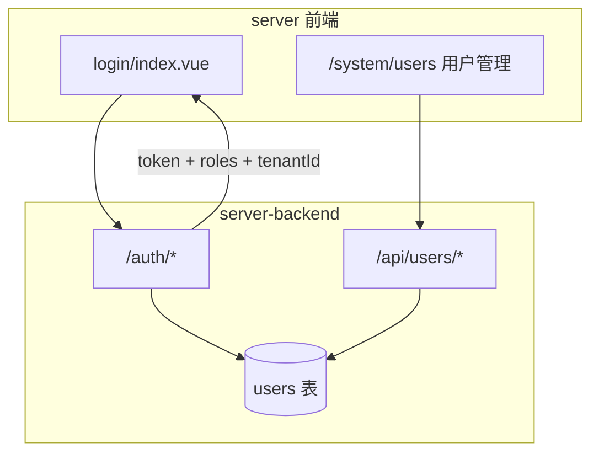

# 模块 02 — 账号登录与用户管理（Auth）

> **状态：** 🟢 S1 已完成；S2 快照 tenant 路径已落地，环境 API 待做  
> **交付基线：** [DELIVERY_STANDARD.md](../DELIVERY_STANDARD.md)  
> **最后更新：** 2026-07-04

## 1. 目标与边界

**负责（标准可交付）：**

- `server-backend` 认证与用户 **持久化** API
- 登录 / 登出 / `GET /auth/me`；Bearer token
- **`/system/users` 管理界面**（admin）：创建用户、禁用、重置密码、**分配角色**
- 密码 **bcrypt/argon2** 存储；禁止明文
- 登录 token 传递给 native / 云同步（任务 2.7）

**不负责：**

- 路由/按钮级 RBAC 规则定义（见 [03-rbac-permissions](03-rbac-permissions.md)）
- 环境 CRUD 业务逻辑（见 [00-native-bridge](00-native-bridge.md)，归属见 03.5）
- Profile 快照存储（见 [05-profile-cloud-sync](05-profile-cloud-sync.md)）

**后端位置：** 全部 Auth / Users API 在 [`server-backend/`](../../server-backend/)，不在 `native-bridge.js`。

---

## 2. 架构与数据流（目标态）



**登录 API（已有）：**

| 方法 | 路径 | 说明 |
|------|------|------|
| POST | `/auth/login` | `{ username, password }` → `{ token, user }` |
| GET | `/auth/me` | Bearer → 当前用户 |
| POST | `/auth/logout` | 注销 session |

**用户管理 API（标准可交付，待实现）：**

| 方法 | 路径 | 权限 | 说明 |
|------|------|------|------|
| GET | `/api/users` | admin | 用户列表 |
| POST | `/api/users` | admin | 创建 `{ username, password, name, roles[], tenantId? }` |
| PUT | `/api/users/:id` | admin | 更新姓名、角色、禁用状态 |
| PUT | `/api/users/:id/password` | admin | 重置密码 |
| DELETE | `/api/users/:id` | admin | 禁用或软删 |

`user` 响应字段（目标）：`id`, `username`, `name`, `roles[]`, `tenantId`, `disabled`, `createdAt`

---

## 3. 关键文件索引

| 路径 | 职责 |
|------|------|
| [`server-backend/src/main.ts`](../../server-backend/src/main.ts) | Nest 入口 |
| [`server-backend/src/auth/`](../../server-backend/src/auth/) | 登录 / session / AuthGuard |
| [`server-backend/src/users/`](../../server-backend/src/users/) | Mongo `users` 集合 + bcrypt seed |
| [`server-backend/src/users/users.controller.ts`](../../server-backend/src/users/users.controller.ts) | `/api/users` CRUD |
| [`server/src/api/system-user.js`](../../server/src/api/system-user.js) | 用户管理 API 封装 |
| [`server/src/views/system/users/index.vue`](../../server/src/views/system/users/index.vue) | 用户管理页 |
| [`server/src/store/modules/user.js`](../../server/src/store/modules/user.js) | Vuex 登录流 |
| [`server/src/utils/request.js`](../../server/src/utils/request.js) | Bearer |

---

## 4. 已完成清单

- [x] **2.1** Auth API 契约 — `/auth/login|me|logout`
- [x] **2.2** 替换 mock — `api/user.js` → backend
- [x] **2.3** Token — cookie + Bearer
- [x] **2.5** 登录页 — 中文、无 demo；proxy `/dev-api` → 3001
- [x] **2.4** 用户持久化 — SQLite / Mongo 双模式
- [x] **2.5** 密码 bcrypt
- [x] **2.6** 登出 + `resetRouter()` + permission 路由重置
- [x] **2.10** `/api/users` CRUD（admin + RolesGuard）
- [x] **2.11** `/system/users` 管理页
- [x] **2.12** `tenantId` 登录响应已含

---

## 5. 待办清单（标准可交付）

| ID | 任务 | 验收标准 | 优先级 | 依赖模块 |
|----|------|----------|--------|----------|
| 2.4 | 用户持久化 DB | **本地** SQLite；**生产** Mongo | **P0** | ✅ |
| 2.5 | 密码哈希 | bcrypt | **P0** | ✅ |
| 2.6 | 登出 + 路由重置 | logout → resetRouter + permission reset | **P0** | ✅ |
| 2.10 | **`/api/users` CRUD** | admin 可调；非 admin 403 | **P0** | ✅ |
| 2.11 | **用户管理 UI** | `/system/users` | **P0** | ✅ |
| 2.12 | **tenantId 字段** | 登录/用户列表含 tenantId | **P0** | ✅ |
| 2.7 | 登录 token → bridge / 云同步 | dev-native-bridge 自动 Bearer；`CLOUD_API_TOKEN` 可选兜底 | **P0** | ✅ dev |
| 2.9 | JWT 或持久 session | 多实例 backend 可扩展 | P2 | 2.4 |
| 2.8 | 自助注册 / 找回密码 | 仅合同要求时做 | P4 | 2.4 |

---

## 6. 手动验证步骤

**当前（登录 MVP）：**

```powershell
cd D:\bytesio\VirtualBrowser\server-backend
copy .env.example .env   # STORAGE_DRIVER=local（7.8 已完成）
npm run start:dev
cd D:\bytesio\VirtualBrowser\server && npm run dev
# admin/admin123 登录；viewer 侧栏菜单更少
```

**标准可交付完成后追加：**

1. admin 打开 `/system/users`，新建 operator 账号  
2. 新账号登录 → 仅 operator 权限  
3. 重启 backend → 用户仍存在  
4. 数据库中 password 字段为哈希  

---

## 7. 关联模块

- **紧密配合：** [03-rbac-permissions](03-rbac-permissions.md)（角色、系统管理路由、API 鉴权）
- **下游：** [05-profile-cloud-sync](05-profile-cloud-sync.md)（token、tenantId）
- **衔接：** [INTEGRATION §Auth→Cloud](../INTEGRATION.md#auth-cloud)、[DELIVERY_STANDARD](../DELIVERY_STANDARD.md)
