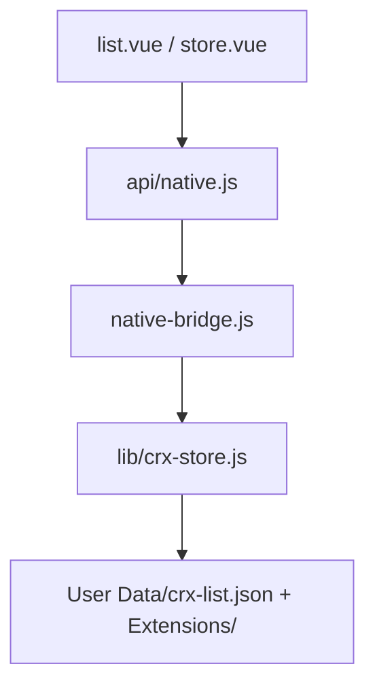

# 模块 04 — CRX 插件扩展

> **状态：** 🟡 部分完成（API+页面 MVP；**标准可交付**缺启动注入与权限）  
> **交付基线：** [DELIVERY_STANDARD.md](../DELIVERY_STANDARD.md)  
> **最后更新：** 2026-07-04

## 1. 目标与边界

**负责：**

- 逆向并实现闭源 Electron 壳中的 CRX native API
- 本地 CRX 列表、上传、删除、启用/禁用
- 插件与环境绑定元数据
- 插件管理 / 插件市场 Vue 页面 MVP

**不负责：**

- Chromium 扩展加载机制修改（通过启动参数注入）
- Profile Cookie 云同步（见 [05-profile-cloud-sync](05-profile-cloud-sync.md)）

---

## 2. 架构与数据流



**存储约定：**

| 路径 | 内容 |
|------|------|
| `%LOCALAPPDATA%\VirtualBrowser\User Data\crx-list.json` | 插件元数据列表 |
| `%LOCALAPPDATA%\VirtualBrowser\Extensions\` | `.crx` 或解压后文件 |

---

## 3. 关键文件索引

| 路径 | 职责 |
|------|------|
| [`server/lib/crx-store.js`](../../server/lib/crx-store.js) | CRX 读写、上传、环境绑定 |
| [`server/mock/native-bridge.js`](../../server/mock/native-bridge.js) | CRX switch cases |
| [`server/src/api/native.js`](../../server/src/api/native.js) | 前端封装 |
| [`server/src/views/crx/list.vue`](../../server/src/views/crx/list.vue) | 插件管理 |
| [`server/src/views/crx/store.vue`](../../server/src/views/crx/store.vue) | 插件市场 MVP |
| [`server/src/router/index.js`](../../server/src/router/index.js) | `/crx/*` 路由 |

---

## 4. 已完成清单

- [x] **4.1** 根因 — 官方 `store.vue`/`list.vue` 为空；功能在闭源壳
- [x] **4.2** 逆向 native API — 自 `app.asar.extracted` 提取方法名
- [x] **4.3** bridge + crx-store 实现
- [x] **4.4** 插件管理页 — 列表、上传、启用/禁用、删除 MVP
- [x] **4.5** 插件市场页 — 本地 catalog + 占位安装
- [x] **4.7** 存储约定 — `crx-list.json` + `Extensions/`

**已实现的 Native 方法：**

| 方法 | 参数 | 说明 |
|------|------|------|
| `getLocalCrxList` / `getCrxList` | 无 | `{ data: { list } }` |
| `setCrxList` | `{ list }` | 写列表 |
| `addLocalCrx` | 路径或 `{ name, base64 }` 或 `{ name, url }` | 上传 |
| `deleteLocalCrx` | `id` | 删除 |
| `enableLocalCrx` | `id`, `enabled` | 启用/禁用 |
| `updateCrx` | `id` | 刷新元数据 |
| `getCrxEnvironments` | `crxId` | `{ assigned, unassigned }` |
| `updateCrxEnvironments` | `crxId`, `envIds[]` | 绑定环境 |

**CrxItem 字段：** `id`, `name`, `version`, `enabled`, `source`, `path`, `url`, `environments[]`, `size`, `createdAt`

---

## 5. 待办清单（细粒度）

| ID | 任务 | 验收标准 | 优先级 | 依赖模块 |
|----|------|----------|--------|----------|
| 4.6 | launchBrowser 注入扩展 {#46} | spawn `--load-extension=`；enabled + 绑定该 env | **P0** | [00.5](00-native-bridge.md#53) |
| 4.7 | 环境表单绑定插件 {#47} | browser 表单 + backend env 元数据 | **P0** | [3.13](03-rbac-permissions.md#35) |
| 4.8 | CRX3 解压完善 | 上传 .crx 正确解包 | **P0** | — |
| 4.9 | 远程插件市场 | store 接远程 catalog | P4 | — |
| 4.10 | 插件权限 {#410} | viewer 不可 upload/delete | **P0** | [03.9](03-rbac-permissions.md#38) |
| 4.11 | 启动联调验收 | 绑定插件 → 启动 → 扩展可见 | **P0** | 4.6, 4.7 |

---

## 6. 手动验证步骤

```powershell
cd D:\bytesio\VirtualBrowser\server
npm run dev

# curl 测 list
curl -s -X POST http://localhost:9527/dev-native-bridge `
  -H "Content-Type: application/json" `
  -d '{"name":"getLocalCrxList","params":[]}'

# UI
# http://localhost:9527/#/crx/list  — 上传 .crx
# http://localhost:9527/#/crx/store — 本地 catalog

# 磁盘
# %LOCALAPPDATA%\VirtualBrowser\User Data\crx-list.json
# %LOCALAPPDATA%\VirtualBrowser\Extensions\
```

---

## 7. 关联模块

- **下游：** [00-native-bridge](00-native-bridge.md)（launch 注入）
- **上游：** [03-rbac-permissions](03-rbac-permissions.md)（谁可管理插件）
- **衔接：** [INTEGRATION §CRX→Launch](../INTEGRATION.md#crx-launch)
