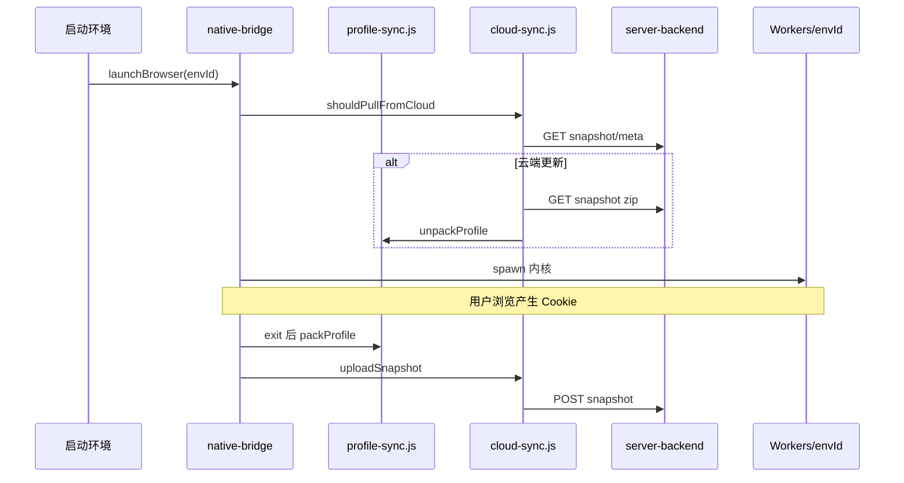

# 模块 05 — Profile 云同步（Cookie + 缓存）

> **状态：** 🟡 部分完成  
> **交付基线：** [DELIVERY_STANDARD.md](../DELIVERY_STANDARD.md)  
> **最后更新：** 2026-07-04

## 1. 目标与边界

**负责：**

- 指纹环境 **运行时** Cookie、LocalStorage、IndexedDB、HTTP 缓存等的打包与解包
- 本地快照 zip 与云端 `server-backend` 快照 API 的上传/下载
- `launchBrowser` 生命周期：启动前 pull、退出后 pack + upload
- 跨机恢复同一环境的网站登录态

**不负责：**

- 指纹配置 JSON import/export（仍走 `browser-list` / `virtual.dat`）
- 用户登录 UI（见 [02-auth-login](02-auth-login.md)）
- 多租户快照隔离（见 [03.8](03-rbac-permissions.md#53)）

**与表单 cookie 区分：** `browser/index.vue` 里 `form.cookie.jsonStr` 是指纹**注入用配置**，≠ Chromium 运行时 `Network/Cookies` 数据库。

---

## 2. 架构与数据流



**本地路径：**

| 路径 | 内容 |
|------|------|
| `%LOCALAPPDATA%\VirtualBrowser\Workers\{envId}\` | Chromium user-data-dir |
| `%LOCALAPPDATA%\VirtualBrowser\ProfileSnapshots\{envId}\` | 本地 zip + `cloud-meta.json` |
| `server-backend/data/profiles/{tenantId}/{envId}/` | 云端 snapshot.zip + meta.json（legacy `{envId}/` 可读） |

---

## 3. 关键文件索引

| 路径 | 职责 |
|------|------|
| [`server/lib/profile-sync.js`](../../server/lib/profile-sync.js) | pack / unpack / getProfileLocalMeta |
| [`server/lib/cloud-sync.js`](../../server/lib/cloud-sync.js) | upload / download / shouldPullFromCloud |
| [`server/mock/native-bridge.js`](../../server/mock/native-bridge.js) | launch 前后 cloud 钩子 |
| [`server/src/api/native.js`](../../server/src/api/native.js) | packProfile 等前端封装 |
| [`server-backend/src/profiles/`](../../server-backend/src/profiles/) | Nest 快照 REST API |
| [`server-backend/src/storage/`](../../server-backend/src/storage/) | 用户/会话存储抽象层 |

---

## 4. 已完成清单

- [x] **5.1** 同步文件清单文档 — 见下文 §8
- [x] **5.2** `packProfile` / `unpackProfile` / `getProfileLocalMeta` — `profile-sync.js`
- [x] **5.3** native-bridge 集成 — pack/unpack/getProfileLocalMeta + launch 钩子
- [x] **5.4** 云快照 API — GET/POST meta + zip — `server-backend`
- [x] **5.5** 本地磁盘存储 — `data/profiles/{tenantId}/{envId}/`（legacy 兼容）
- [x] **5.6** 生命周期 — launch 前 pull；exit 后 pack + upload（需 `CLOUD_API_TOKEN`）
- [x] **5.x** smoke 测试 — envId=1，18 文件 pack/unpack 往返通过

---

## 5. 待办清单（细粒度）

| ID | 任务 | 验收标准 | 优先级 | 依赖模块 |
|----|------|----------|--------|----------|
| 5.7 | 环境列表同步状态 UI {#57} | 显示 local/cloud version、最后同步时间、失败提示 | **P0** | 2.7 |
| 5.8 | 「立即同步」按钮 {#58} | 手动 pack+upload 或 pull+unpack | **P0** | 5.7 |
| 5.9 | 自动 token {#59} | bridge 使用登录 Bearer；`CLOUD_API_TOKEN` 可选兜底 | **P0** | ✅ dev |
| 5.10 | 冲突策略 UI | 云端 version 更高时提示「将覆盖本地」 | P1 | 5.7 |
| 5.11 | 体积上限 / 增量同步 | 大 profile 分片（可选） | P4 | — |
| 5.12 | 跨机验收脚本 | 文档 + npm script A→B | **P0** | 5.9 |
| 5.13 | tenant 路径隔离 | 与 [3.8](03-rbac-permissions.md#38) 一致 | **P0** | [03](03-rbac-permissions.md) |

---

## 6. 手动验证步骤

### 6.1 本地 pack

```powershell
curl -s -X POST http://localhost:9527/dev-native-bridge `
  -H "Content-Type: application/json" `
  -d '{"name":"getProfileLocalMeta","params":["1"]}'
```

### 6.2 云同步（dev：登录即可，无需手动 token）

```powershell
# 终端 1
cd D:\bytesio\VirtualBrowser\server-backend
npm run start:dev

cd D:\bytesio\VirtualBrowser\server
npm run dev
# admin 登录 → 启动环境 → 关闭 → 日志 profile auto-pack + cloud upload ok
# （可选）$env:CLOUD_API_TOKEN 仍可作为未登录调试兜底
```

### 6.3 跨机 pull

删本地 `Workers\{envId}` 同步目录 + `ProfileSnapshots\{envId}\cloud-meta.json`，同 token 再启动 → 日志 `cloud pull ok`。

---

## 7. 关联模块

- **上游：** [02-auth-login](02-auth-login.md)（Bearer token）、[03-rbac](03-rbac-permissions.md)（快照归属）
- **下游：** [00-native-bridge](00-native-bridge.md)（launch 生命周期）
- **衔接：** [INTEGRATION §Auth→Cloud](../INTEGRATION.md#auth-cloud)、[§RBAC→Profile](../INTEGRATION.md#rbac-profile)

---

## 8. 同步范围规范（原 PROFILE_SYNC.md）

### 8.1 包含项

仅打包 **Profile 目录**（`Default/`、`Profile */`）下 Cookie / Web 存储 / HTTP 缓存相关条目：

| 相对路径 | 说明 |
|----------|------|
| `Network/Cookies` (+ journal) | Chromium 96+ Cookie |
| `Cookies` (+ journal) | 旧版路径 |
| `Local Storage/` | localStorage |
| `IndexedDB/` | IndexedDB |
| `Session Storage/` | sessionStorage |
| `Cache/` | HTTP 磁盘缓存 |
| `Code Cache/` | V8 / WASM |
| `Service Worker/` | SW + CacheStorage |
| `blob_storage/` | Blob 存储 |

**不包含** `virtual.dat`（指纹配置仍走 JSON import/export）。

### 8.2 排除项

**Worker 根目录整目录跳过：** GPUCache、ShaderCache、component_crx_cache、Safe Browsing 等 Chrome 组件目录（完整列表见 git 历史 `docs/PROFILE_SYNC.md` 或 `profile-sync.js` 内 `EXCLUDE_DIR_NAMES`）。

**Profile 内排除：** GPUCache、ShaderCache、GrShaderCache 等。

**锁文件：** LOCK、LOG、SingletonLock 等。

### 8.3 unpack 行为

1. 解压前备份 `Workers/{envId}` → `Workers/{envId}.backup.{timestamp}`
2. zip 内文件 **合并覆盖**（不删 zip 未含文件）
3. 浏览器运行中勿 unpack

### 8.4 Native API

| 方法 | 参数 | 返回 |
|------|------|------|
| `packProfile` | `envId` | `{ path, size, meta }` |
| `unpackProfile` | `envId`, `zipPath` | `{ backupPath, extracted, meta }` |
| `getProfileLocalMeta` | `envId` | `{ fileCount, totalSize, files[] }` |

### 8.5 云 API

Base：`http://localhost:3001`（`CLOUD_API_BASE`）。Header：`Authorization: Bearer <token>`。

| 方法 | 路径 | 说明 |
|------|------|------|
| GET | `/api/profiles/:envId/snapshot/meta` | `{ version, size, updatedAt, envId }` |
| GET | `/api/profiles/:envId/snapshot` | zip 流 |
| POST | `/api/profiles/:envId/snapshot` | raw body，`Content-Type: application/zip` |

**version：** 每次上传递增；pull 时与本地 `cloud-meta.json` 比较。

### 8.6 cloud-sync.js 函数

| 函数 | 说明 |
|------|------|
| `getSnapshotMeta(envId, token)` | 云端 meta，无则 null |
| `uploadSnapshot(envId, zipPath, token)` | 上传并写 `cloud-meta.json` |
| `downloadSnapshot(envId, workerDir, token)` | 下载并 unpack |
| `shouldPullFromCloud(envId, workerDir, token)` | 是否 pull |

### 8.7 环境变量

| 变量 | 默认 | 说明 |
|------|------|------|
| `CLOUD_API_BASE` | `http://localhost:3001` | 后端 URL |
| `CLOUD_API_TOKEN` | 空 | **临时方案**；未设置则跳过云同步 |

本地缓存：`ProfileSnapshots/{envId}/cloud-meta.json`

---

## 9. native-bridge 行为摘要

1. **launchBrowser 前：** 有 token → `shouldPullFromCloud` → 必要时 download + unpack  
2. **exit 后：** auto-pack → 有 token → upload  
3. **失败降级：** 无 token / 404 → 跳过云步骤，本地仍可用
