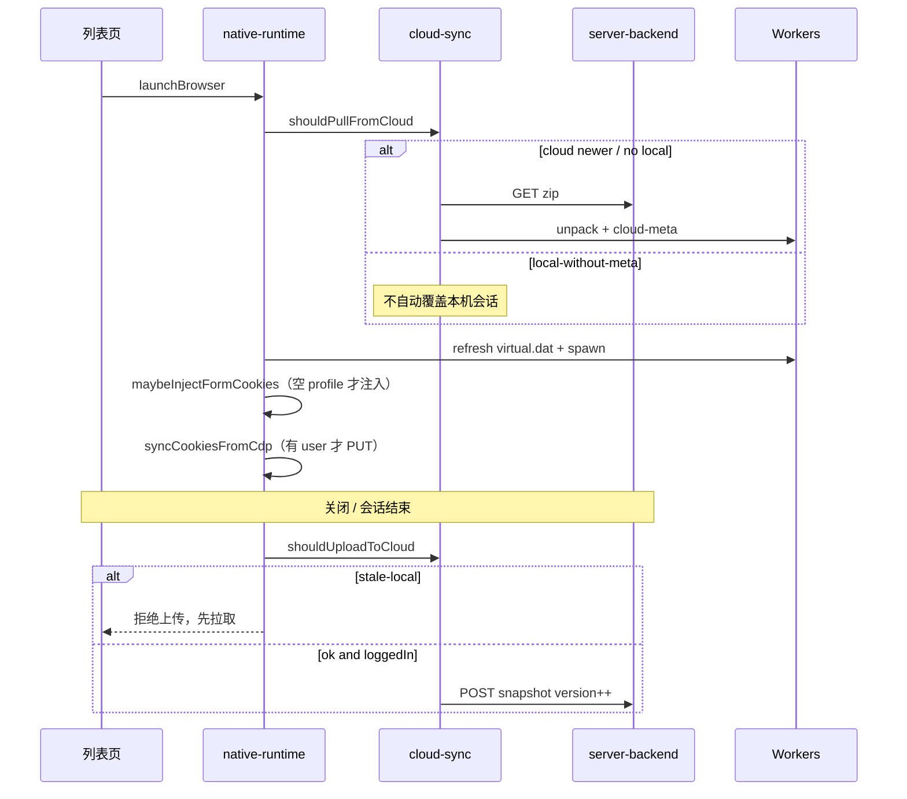

# 模块 05 — Profile 云同步（Cookie + 缓存）

> **状态：** 🟢 主路径已落地  
> **交付基线：** [DELIVERY_STANDARD.md](../DELIVERY_STANDARD.md)  
> **最后更新：** 2026-08-02

## 1. 目标与边界

**负责：**

- 指纹环境 **运行时** Cookie、LocalStorage、IndexedDB 等的打包与解包
- 本地快照 zip 与云端快照 API 的上传/下载（version 闸门）
- `launchBrowser`：**启动前 auto-pull**（fail-soft）、关闭/会话后 pack + upload（需登录到家 `user` cookie）
- 跨机恢复同一环境的网站登录态
- 自动刷新责任机（`jddjRefreshLeader`）与新建带 Cookie 默认开自动刷新

**不负责：**

- 指纹配置 JSON 本体同步（走 `environments` + `virtual.dat`，不经 zip）
- 用户登录 UI（见 [02-auth-login](02-auth-login.md)）
- 多租户快照隔离细节（见 [03.8](03-rbac-permissions.md#53)）

**与表单 cookie 区分：** `form.cookie.jsonStr` 是指纹**注入用配置**，≠ Chromium 运行时 `Network/Cookies` 数据库。

---

## 1.1 三层数据（心智模型）

| 层 | 存什么 | 本地 | 云端 | 谁消费 |
|---|---|---|---|---|
| **指纹配置** | UA/WebGL/代理/主页等 | `browser-list.json`、`Workers/{id}/virtual.dat` | Mongo `environments.payload` | 内核按 `--worker-id` 读 `virtual.dat` |
| **登录会话** | Cookies / Storage 等 | `Workers/{id}/` | `profiles/.../snapshot.zip` + `meta.version` | 启动 pull / 关闭 upload |
| **业务快照** | 店名、店 ID、营业状态 | 列表 `siteSnapshot` | Mongo `payload.siteSnapshot.jddj` | 列表展示；与 zip 无关 |

另有 **Cookie JSON 镜像**：CDP 读出后写 list/`virtual.dat`；存在非空 `name===user` 才 `PUT` 环境 cookie。与 zip **两条通道**。

**一句话：**

- 改指纹 → 保存环境 → `virtual.dat` → 下次启动读新指纹  
- 换机器继续登录 → 启动 pull zip（`cloud.version > local`）→ 本地已有会话则跳过表单 Cookie 注入  
- 新建带 Cookie → 默认 `autoJddj` / `jddjAutoRefresh`（仅创建）  
- 多终端 → 上传前 version 闸门（`stale-local`）+ 仅责任机跑自动刷新  

---

## 2. 启动与同步时序

```mermaid
sequenceDiagram
  participant UI as 列表页
  participant NR as native-runtime
  participant CS as cloud-sync
  participant BE as server-backend
  participant Disk as Workers

  UI->>NR: launchBrowser
  NR->>CS: shouldPullFromCloud
  alt cloud newer / no local
    CS->>BE: GET zip
    CS->>Disk: unpack + cloud-meta
  else local-without-meta
    Note over CS: 不自动覆盖本机会话
  end
  NR->>Disk: refresh virtual.dat + spawn
  NR->>NR: maybeInjectFormCookies（空 profile 才注入）
  NR->>NR: syncCookiesFromCdp（有 user 才 PUT）
  Note over UI,BE: 关闭 / 会话结束
  NR->>CS: shouldUploadToCloud
  alt stale-local
    NR-->>UI: 拒绝上传，先拉取
  else ok and loggedIn
    CS->>BE: POST snapshot version++
  end
```

### Pull（`shouldPullFromCloud`）

| 条件 | pull | reason |
|------|------|--------|
| 云端无包 | 否 | `no-cloud-snapshot` |
| 本地无会话文件 | 是 | `no-local-data` |
| 本地有数据但无 `cloud-meta.version` | **否** | `local-without-meta` |
| `cloud.version > local.version` | 是 | `cloud-newer` |
| 否则 | 否 | `up-to-date` |

手动「从云端拉取」= **强制**下载。启动 pull 超时 fail-soft，不阻断 spawn。

### Upload（`shouldUploadToCloud`）

- 若 `cloud.version > local.cloud-meta.version` → **拒绝**，日志 `stale-local`，提示先拉取  
- 另需：有 token + 到家登录态（`user` cookie）才实际上传  
- stop / exit / 会话 / 手动上传共用 `uploadSnapshot` 闸门  

### UI 同步状态

`local-without-meta`：本机有会话、未对齐云端 meta，**不会自动 pull 覆盖**（与 pull 判定一致；勿再标成「云端较新」）。

---

## 3. 自动刷新与多终端

| 项 | 说明 |
|----|------|
| 环境开关 | `autoJddj` / `jddjAutoRefresh`（双字段） |
| 新建默认 | Cookie `mode=1` 且 `value[]` 非空 → 创建时默认双开（编辑不联动） |
| 周期 | `global.dat.jddjScheduleMs`，默认 30 分钟 |
| 责任机 | `global.dat.jddjRefreshLeader`（缺省 `true`）；设置对话框可关；非责任机不跑 interval |
| 调度位置 | 列表页前端 `startJddjSchedule`（页面不打开则不跑） |
| 会话流水线 | pull → 无头启动 → 导航 → cookie → scrape → site-snapshot → 有登录则 upload |

---

## 4. 本地 / 云端路径

| 路径 | 内容 |
|------|------|
| `%LOCALAPPDATA%\VirtualBrowser\Workers\{envId}\` | Chromium user-data-dir |
| `%LOCALAPPDATA%\VirtualBrowser\ProfileSnapshots\{envId}\` | 本地 zip + `cloud-meta.json` |
| `%LOCALAPPDATA%\VirtualBrowser\User Data\global.dat` | `apiLink`、`jddjScheduleMs`、`jddjRefreshLeader` 等 |
| `server-backend` `DATA_DIR/profiles/{tenantId}/{envId}/` | `snapshot.zip` + `meta.json` |

---

## 5. 关键文件

| 路径 | 职责 |
|------|------|
| [`server/lib/profile-sync.js`](../../server/lib/profile-sync.js) | pack / unpack / hasLocalSyncData |
| [`server/lib/cloud-sync.js`](../../server/lib/cloud-sync.js) | upload / download / shouldPull / shouldUpload |
| [`server/lib/native-runtime.js`](../../server/lib/native-runtime.js) | launch pull、stop/exit upload、sync 状态 |
| [`server/lib/session-worker.js`](../../server/lib/session-worker.js) | 会话、登录闸门、site-snapshot |
| [`server/src/api/native.js`](../../server/src/api/native.js) | `applyCreateAutoRefreshDefaults`、`addBrowser` |
| [`server-backend/src/browser/fingerprint.defaults.ts`](../../server-backend/src/browser/fingerprint.defaults.ts) | 创建缺省 + 自动刷新默认 |
| [`server/src/views/browser/index.vue`](../../server/src/views/browser/index.vue) | 列表、责任机开关、定时刷新 |

---

## 6. 已完成清单

- [x] pack / unpack / 云快照 API / tenant 路径  
- [x] launch 前 pull；exit/stop/会话 upload  
- [x] 登录态闸门（`user` cookie）  
- [x] 上传 version 闸门（`stale-local`）  
- [x] sync 状态 `local-without-meta` 与 pull 对齐  
- [x] 责任机 `jddjRefreshLeader`  
- [x] 新建有 Cookie 默认开自动刷新  

## 7. 待办（可选）

| ID | 任务 | 说明 |
|----|------|------|
| 5.10 | 冲突策略 UI | 过期上传时引导一键拉取 |
| 5.11 | 体积上限 / 增量 | 大 profile 分片 |
| — | 桌面壳常驻定时器 | 不依赖列表页是否打开 |
