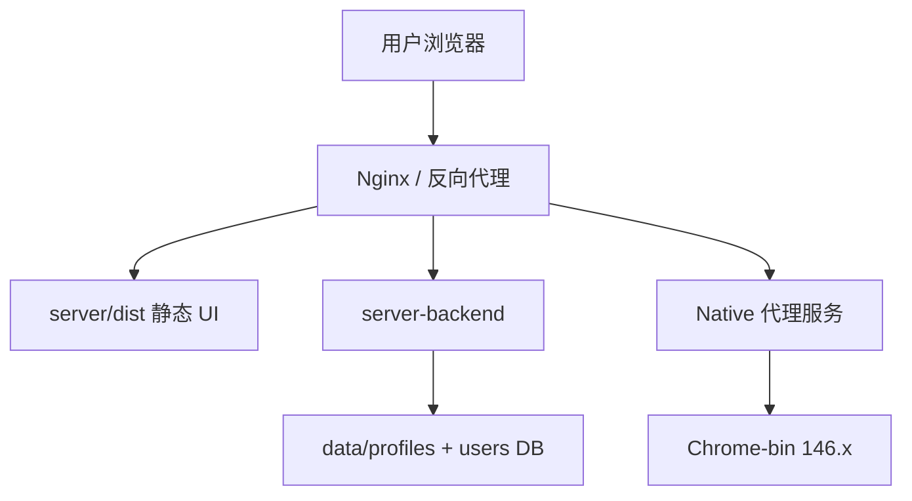

# 模块 06 — 生产部署与交付

> **状态：** 🔴 标准可交付必做  
> **交付基线：** [DELIVERY_STANDARD.md](../DELIVERY_STANDARD.md)  
> **最后更新：** 2026-07-04

## 1. 目标与边界

**负责：**

- 路线 B 生产交付物清单（内核 + 静态 UI + backend + 配置）
- 构建与环境变量（dev / staging / prod）
- 静态资源托管与 API 反向代理
- native 能力在生产环境的代理方案
- worker 新标签页部署纳入交付流程

**不负责：**

- 功能业务逻辑实现（见各模块 00–05）
- Mac/Linux 客户端（Mission 范围外）

**红线：** **禁止** 恢复 `app.asar`、`npm run app`、外层 Electron 管理壳。

---

## 2. 架构与数据流（目标生产态）



**dev 与生产差异：**

| 项 | dev | 生产（目标） |
|----|-----|--------------|
| UI | webpack :9527 | `dist/` 静态文件 |
| API | proxy `/dev-api` → :3001 | Nginx `/api` → backend |
| Native | webpack 内 `/dev-native-bridge` | sidecar 或 backend 代理 |
| **后端存储** | **`STORAGE_DRIVER=local`**（SQLite，`data/local/app.db`） | **`STORAGE_DRIVER=mongo`** + `MONGODB_URI` |
| 云 token | `CLOUD_API_TOKEN` 环境变量 | 登录 session 自动注入 |

---

## 3. 关键文件索引

| 路径 | 职责 |
|------|------|
| [`server/package.json`](../../server/package.json) | `build:prod` / `build:stage` |
| [`server/.env.development`](../../server/.env.development) | dev API 基址 |
| [`server/.env.production`](../../server/.env.production) | prod API 基址（当前 `/prod-api`） |
| [`server/.env.staging`](../../server/.env.staging) | staging |
| [`server/vue.config.js`](../../server/vue.config.js) | build 与 devServer |
| [`server-backend/`](../../server-backend/) | 业务 API 进程 |
| [`worker/scripts/deploy-worker.ps1`](../../worker/scripts/deploy-worker.ps1) | 新标签页部署到内核 |
| [`config/chrome-bin.paths.json`](../../config/chrome-bin.paths.json) | 内核路径 |
| [`config/PATHS.md`](../../config/PATHS.md) | 路径说明 |

---

## 4. 已完成清单

- [x] **6.x** dev 三板斧文档化 — 见 [docs/README.md](../README.md) 日常命令
- [x] **6.x** `server-backend` MVP 可独立 `npm start`
- [x] **6.x** 前端 `npm run build` 可通过（UI 私有化后验证）

---

## 5. 待办清单（细粒度）

| ID | 任务 | 验收标准 | 优先级 | 依赖模块 |
|----|------|----------|--------|----------|
| 6.1 | 交付物清单正文 | 本文 §7：内核 + dist + backend + DB | **P0** | S1–S3 |
| 6.2 | 生产 static 托管 | Nginx/Express 托管 `server/dist` | **P0** | 6.1 |
| 6.3 | API + native 反向代理 | `/api` → backend；native JWT | **P0** | [0.1](00-native-bridge.md#51), [3.4](03-rbac-permissions.md#34) |
| 6.4 | Native 生产代理 | 等价 dev-native-bridge | **P0** | 6.3 |
| 6.5 | 环境变量清单 | `PORT`、`DATA_DIR`、`STORAGE_DRIVER`、`MONGODB_URI`（生产）等 | **P0** | 6.1, [07](07-backend-stack.md) |
| 6.6 | 交付检查清单 | 禁止 app.asar、内核版本、worker | **P0** | 6.1 |
| 6.7 | worker 纳入交付 | deploy:worker SOP | **P0** | 6.1 |
| 6.8 | staging 环境 | build:stage 预发 | P1 | [1.3](01-ui-branding.md#5) |
| 6.9 | HTTPS + cookie Secure | 生产 cookie 策略 | P1 | 6.2 |
| 6.10 | 客户安装手册 | 一页纸安装步骤 | **P0** | 6.1 |

---

## 6. 手动验证步骤（dev 基线）

```powershell
# 构建
cd D:\bytesio\VirtualBrowser\server
npm run build:prod
# 输出 dist/

# backend
cd D:\bytesio\VirtualBrowser\server-backend
npm start

# worker（可选）
cd D:\bytesio\VirtualBrowser\worker
npm run deploy:worker
```

生产托管验证待 6.2–6.3 完成后补充。

---

## 7. 交付物清单（草案）

| 组件 | 路径 / 产物 | 说明 |
|------|-------------|------|
| 指纹内核 | `Chrome-bin/VirtualBrowser/146.0.7680.72/` | 含 VirtualBrowser.exe |
| 管理 UI | `server/dist/` | `npm run build:prod` |
| 业务后端 | `server-backend/` | Node 18+；生产 **`STORAGE_DRIVER=mongo`** |
| 数据库 | MongoDB（生产） | 本地 dev 用 SQLite，见 [07-backend-stack](07-backend-stack.md) |
| 新标签页 | 内核内 `worker/` | `deploy:worker` |
| 路径配置 | `config/chrome-bin.paths.json` | 可按安装目录调整 |
| 用户数据 | `%LOCALAPPDATA%\VirtualBrowser\` | 运行时生成 |

---

## 8. 关联模块

- **依赖全部模块：** 生产需 00 bridge 代理、02 auth、03 RBAC、05 云存储路径
- **衔接：** [INTEGRATION §Deploy→All](../INTEGRATION.md#deploy-all)
