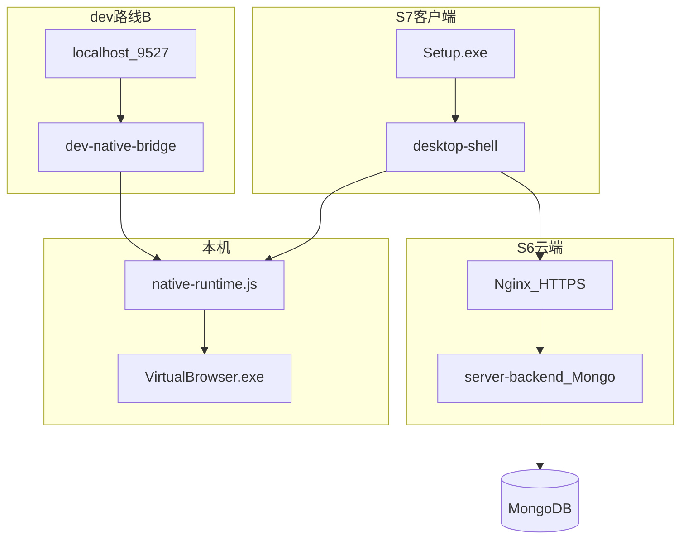

# 模块 06 — 生产部署与交付

> **状态：** 🟡 S6 mongo HTTP ✅ · S7 Setup-0.1.0.exe ✅ · HTTPS/实机待验  
> **交付基线：** [DELIVERY_STANDARD.md](../DELIVERY_STANDARD.md)  
> **最后更新：** 2026-07-14  
> **报告：** [S6-prod](../acceptance-reports/S6-prod-2026-07-12.md) · [S7-build](../acceptance-reports/S7-build-2026-07-14.md)

## 1. 目标与边界

**三条交付线：**

| 线 | 验收阶段 | 产物 |
|----|----------|------|
| **dev** | 日常开发 | `npm run dev` + dev-native-bridge（不变） |
| **云端** | S6 | `server-backend` + Mongo + HTTPS + [`CLOUD_DEPLOY.md`](../CLOUD_DEPLOY.md) |
| **客户端** | S7 | `VirtualBrowser-Setup.exe`（`desktop-shell/` + NSIS） |

**负责：**

- S6：云端 API 部署、环境变量、CORS、Profile 存储路径
- S7：Electron 桌面壳、内嵌 `server/dist`、捆绑 Chrome-bin、构建流水线
- worker 新标签页纳入交付；`native-runtime.js` 与 S8 共享（见 INFRA-A）

**不负责：**

- 功能业务逻辑（见模块 00–05、08）
- Mac/Linux 客户端

**红线：** **禁止** 恢复原厂 `app.asar`、`npm run app`。**允许** 新建 `desktop-shell/` 二开 Electron。

---

## 2. 架构（dev + 客户交付）



**dev 与生产差异：**

| 项 | dev | S6 云端 | S7 客户端 |
|----|-----|---------|-----------|
| UI | webpack :9527 | — | desktop-shell 窗口 |
| 管理 API | `/dev-api` → :3001 | HTTPS → backend | HTTPS → 云端 |
| Native | dev-native-bridge | — | 主进程 native-runtime |
| 存储 | SQLite | Mongo | 用户数据 %LOCALAPPDATA% |

---

## 3. 关键文件索引

| 路径 | 职责 |
|------|------|
| [`server/package.json`](../../server/package.json) | `build:prod` / `build:stage` |
| [`server/.env.development`](../../server/.env.development) | dev API 基址 |
| [`server/.env.production`](../../server/.env.production) | prod API 基址（当前 `/prod-api`） |
| [`server/.env.staging`](../../server/.env.staging) | staging |
| [`server/vue.config.js`](../../server/vue.config.js) | build 与 devServer |
| [`server-backend/`](../../server-backend/) | 业务 API 进程 |
| [`worker/scripts/deploy-worker.ps1`](../../worker/scripts/deploy-worker.ps1) | 新标签页部署到内核 |
| [`config/chrome-bin.paths.json`](../../config/chrome-bin.paths.json) | 内核路径 |
| [`config/PATHS.md`](../../config/PATHS.md) | 路径说明 |

---

## 4. 已完成清单

- [x] **6.x** dev 三板斧文档化 — 见 [docs/README.md](../README.md) 日常命令
- [x] **6.x** `server-backend` MVP 可独立 `npm start`
- [x] **6.x** 前端 `npm run build` 可通过（UI 私有化后验证）

---

## 5. 待办清单（细粒度）

| ID | 任务 | 验收标准 | 优先级 | 依赖模块 |
|----|------|----------|--------|----------|
| 6.1 | 交付物清单正文 | 本文 §7：内核 + dist + backend + DB | **P0** | S1–S3 |
| 6.2 | 生产 static 托管 | Nginx/Express 托管 `server/dist` | **P0** | 6.1 |
| 6.3 | API + native 反向代理 | `/api` → backend；native JWT | **P0** | [0.1](00-native-bridge.md#51), [3.4](03-rbac-permissions.md#34) |
| 6.4 | Native 生产代理 | 等价 dev-native-bridge | **P0** | 6.3 |
| 6.5 | 环境变量清单 | `PORT`、`DATA_DIR`、`STORAGE_DRIVER`、`MONGODB_URI`（生产）等 | **P0** | 6.1, [07](07-backend-stack.md) |
| 6.6 | 交付检查清单 | 禁止 app.asar、内核版本、worker | **P0** | 6.1 |
| 6.7 | worker 纳入交付 | deploy:worker SOP | **P0** | 6.1 |
| 6.8 | staging 环境 | build:stage 预发 | P1 | [1.3](01-ui-branding.md#5) |
| 6.9 | HTTPS + cookie Secure | 生产 cookie 策略 | P1 | 6.2 |
| 6.10 | 客户安装手册 | 一页纸安装步骤 | **P0** | 6.1 |
| **6.y.1** | desktop-shell MVP | Electron + preload chrome.send | **P0** | INFRA-A |
| **6.y.2** | build-client.ps1 + NSIS | VirtualBrowser-Setup.exe | **P0** | 6.y.1 |
| **6.y.3** | client.json API 基址 | 构建注入云端 URL | **P0** | S6 |

---

## 6. 手动验证步骤（dev 基线）

```powershell
# 构建
cd D:\bytesio\VirtualBrowser\server
npm run build:prod
# 输出 dist/

# backend
cd D:\bytesio\VirtualBrowser\server-backend
npm start

# worker（可选）
cd D:\bytesio\VirtualBrowser\worker
npm run deploy:worker
```

生产托管验证待 6.2–6.3 完成后补充。

---

## 7. 交付物清单

### S6 云端

| 组件 | 说明 |
|------|------|
| `server-backend` | Node 18+，`STORAGE_DRIVER=mongo` |
| MongoDB | 用户/环境/会话 |
| `data/profiles/` | Profile zip |
| `CLOUD_DEPLOY.md` | 部署 SOP |

### S7 客户端

| 组件 | 说明 |
|------|------|
| `VirtualBrowser-Setup.exe` | NSIS 安装包 |
| 内嵌 `server/dist` | Vue 构建产物 |
| `Chrome-bin/146.x/` | 指纹内核 |
| `config/client.json` | 云端 API 基址 |
| `%LOCALAPPDATA%\VirtualBrowser\` | 运行时用户数据 |

---

## 8. 关联模块

- **依赖全部模块：** 生产需 00 bridge 代理、02 auth、03 RBAC、05 云存储路径
- **衔接：** [INTEGRATION §Deploy→All](../INTEGRATION.md#deploy-all)
